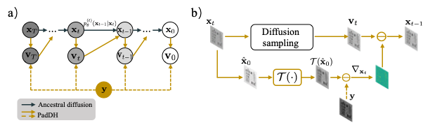

# PadDH:Physics-aware diffusion model
This repository contains the code for the paper 
<br /> Zhang, Yunping, Xihui Liu, and Edmund Y. Lam. "Single-shot inline holography using a physics-aware diffusion model." Optics Express 32.6 (2024): 10444-10460.

 In this paper, we propose a novel unsupervised algorithm called physics-aware diffusion model (PadDH), specifically designed for snapshot digital holographic reconstruction. 
 PadDH represents a pioneering adaptation of the diffusion model that seamlessly integrates the physical model into its generative process. 
Through comprehensive experiments using both synthetic and experimental data, we validate the remarkable capabilities of PadDH in effectively reducing twin-image contamination and generating high-quality reconstructions. Our work showcases significant advancements in holographic imaging by harnessing the powerful prior knowledge encoded in pre-trained diffusion models, leading to improved reconstruction quality and enhanced efficiency from single-shot measurements.
 
       
<br /> If you have any question on the code, please contact the author: yp000925@connect.hku.hk

## Requirements
- Python 3
- Pytorch 1.11.0 
- cudatoolkit 11.3.1
- Pillow  9.0.1 
- GPU memory >= 10G

## Usage 
### Reproduce the results in the paper
- Download the pre-trained diffusion model from the open-source [model card](https://github.com/openai/guided-diffusion/tree/main). In our experiment, we use the model trained on class-unconditional ImageNet: [256x256_diffusion_uncond.pt](https://openaipublic.blob.core.windows.net/diffusion/jul-2021/256x256_diffusion_uncond.pt)
- Update the model path in configuration file ```configs/config.yaml```
- The simulation verification has been done on two datasets: ```data/cells``` and ```data/USAF```. The results will be saved in the folder ```./results``` by default.
  - Run ```python simulation.py --task_config configs/task_sim_USAF.yaml``` to reproduce the simulation results of USAF target in the paper.
  - Run ```python simulation.py --task_config configs/task_sim_cell.yaml``` to reproduce the simulation results of cells target in the paper.
- The experimental verification has been done on two datasets: ```ExpSample/USAF``` and ```ExpSample/convallaria```. The results will be saved in the folder ```./results``` by default.
  - Run ```python experiment.py --task_config configs/task_exp.yaml --exp_name USAF``` to reproduce the experimental results of USAF target in the paper.
  - Run ```python experiment.py --task_config configs/task_exp.yaml --exp_name convallaria``` to reproduce the experimental results of convallaria sample in the paper.

### Try your own dataset 
The following is a simple process to try your own dataset.
- Download the pre-trained diffusion model from the open-source [model card](https://github.com/openai/guided-diffusion/tree/main). In our experiment, we use the model trained on class-unconditional ImageNet: [256x256_diffusion_uncond.pt](https://openaipublic.blob.core.windows.net/diffusion/jul-2021/256x256_diffusion_uncond.pt)
- Update the model path in configuration file ```configs/config.yaml```
- Prepare your own dataset. The dataset should be saved in the folder ```./data/YOUR_DATA```. The dataset should be saved in the format of ```.png``` or ```.jpg```.
- Fill in the parameters of your setup in ```configs/task_config.yaml```
- Run ```python main.py --task_config configs/task_exp.yaml --exp_name YOUR_EXP_NAME --save_dir YOUR_OUTPATH``` to reconstruct your own data. The results will be saved in the folder ```./YOUR_OUTPATH```.

[//]: # (    - Modify the function ```parse_task``` in ```experiment.py``` to load your own dataset. )

[//]: # (      ```python)

[//]: # (        def parse_task&#40;exp_name&#41;: )

[//]: # (            # define the prop_kernel and measurement &#40;preprocessed hologram&#41; for each experiment)

[//]: # (            if exp_name == 'YOUR_DATA':)

[//]: # (                # define the preprocess_img function to load your own data, it should be normalized to [0,1] and the shape should be [256,256] to match the pre-trained network.)

[//]: # (                processed_img = preprocess_img&#40;'./data/YOUR_DATA'&#41;  )

[//]: # (                # define the prop_kernel, fill in your own parameters. Note that if you use resize, you should also update the parameters of deltax and deltay accordingly.)

[//]: # (                prop_kernel = dict&#40;wavelength=None,deltax=None,deltay=None,distance=None, nx=256, ny=256&#41;)

[//]: # (                return {'prop_kernel':prop_kernel, 'measurement':processed_img} )

[//]: # (      ```)
    